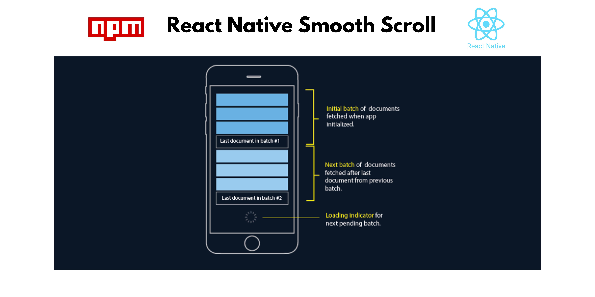

# React Native Smooth Scroll

A lightweight and customizable infinite scroll component for React Native. Supports pagination, pull-to-refresh, and error handling.


---

## Features
- **Infinite Scroll**: Automatically loads more data as the user scrolls.
- **Pagination**: Supports paginated data fetching.
- **Pull-to-Refresh**: Allows refreshing the list with a pull gesture.
- **Error Handling**: Displays an error message if data fetching fails.
- **Customizable**: Customize the loader, error, and empty list components.

---

## Installation

Install the library using npm or yarn:

```bash
npm install react-native-smooth-scroll
```

or

```bash
yarn add react-native-smooth-scroll
```

---

## Usage

### Basic Example

```javascript
import React, { useState, useEffect } from 'react';
import { SafeAreaView, StyleSheet, Text, View, ActivityIndicator } from 'react-native';
import InfiniteScroll from 'react-native-smooth-scroll';

const App = () => {
  const [data, setData] = useState([]);
  const [page, setPage] = useState(1);
  const [hasMore, setHasMore] = useState(true);
  const [isRefreshing, setIsRefreshing] = useState(false);
  const [error, setError] = useState(null);

  const fetchData = async (pageNumber) => {
    try {
      const response = await fetch(
        `https://jsonplaceholder.typicode.com/posts?_limit=10&_page=${pageNumber}`
      );
      if (!response.ok) throw new Error('Failed to fetch data');
      const newData = await response.json();
      return newData;
    } catch (err) {
      setError(err.message);
      return [];
    }
  };

  const loadMore = async () => {
    if (error) return;
    const newData = await fetchData(page + 1);
    if (newData.length > 0) {
      setData((prevData) => [...prevData, ...newData]);
      setPage((prevPage) => prevPage + 1);
    } else {
      setHasMore(false);
    }
  };

  const handleRefresh = async () => {
    setIsRefreshing(true);
    setError(null);
    const initialData = await fetchData(1);
    setData(initialData);
    setPage(1);
    setHasMore(true);
    setIsRefreshing(false);
  };

  useEffect(() => {
    const initializeData = async () => {
      const initialData = await fetchData(1);
      setData(initialData);
    };
    initializeData();
  }, []);

  return (
    <SafeAreaView style={styles.container}>
      <InfiniteScroll
        data={data}
        renderItem={({ item }) => (
          <View style={styles.item}>
            <Text style={styles.title}>{item.title}</Text>
            <Text>{item.body}</Text>
          </View>
        )}
        keyExtractor={(item) => item.id.toString()}
        loadMore={loadMore}
        hasMore={hasMore}
        onRefresh={handleRefresh}
        isRefreshing={isRefreshing}
        error={error}
        errorComponent={<Text style={styles.errorText}>{error}</Text>}
      />
    </SafeAreaView>
  );
};

const styles = StyleSheet.create({
  container: {
    flex: 1,
    padding: 16,
  },
  item: {
    padding: 16,
    borderBottomWidth: 1,
    borderBottomColor: '#ccc',
  },
  title: {
    fontSize: 16,
    fontWeight: 'bold',
  },
  errorText: {
    textAlign: 'center',
    color: 'red',
    marginVertical: 20,
  },
});

export default App;
```

---

## Props

| Prop                | Type               | Description                                                                 |
|---------------------|--------------------|-----------------------------------------------------------------------------|
| `data`              | `Array`            | The array of data items to render.                                          |
| `renderItem`        | `Function`         | Function to render each item in the list.                                   |
| `keyExtractor`      | `Function`         | Function to extract a unique key for each item.                             |
| `loadMore`          | `Function`         | Function to load more data. Should return a `Promise`.                      |
| `hasMore`           | `Boolean`          | Whether there is more data to load.                                         |
| `loaderComponent`   | `React.ReactNode`  | Custom loader component to display while loading more data.                 |
| `listEmptyComponent`| `React.ReactNode`  | Component to display when the list is empty.                                |
| `onRefresh`         | `Function`         | Function to refresh the list. Should return a `Promise`.                    |
| `isRefreshing`      | `Boolean`          | Whether the list is currently refreshing.                                   |
| `error`             | `String` or `null` | Error message to display if data fetching fails.                            |
| `errorComponent`    | `React.ReactNode`  | Custom error component to display when there's an error.                    |
| `...flatListProps`  | `Object`           | Additional props to pass to the underlying `FlatList` component.            |

---

## Customization

### Custom Loader
Pass a custom loader component to the `loaderComponent` prop:

```javascript
<InfiniteScroll
  loaderComponent={<MyCustomLoader />}
  // other props
/>
```

### Custom Error Component
Pass a custom error component to the `errorComponent` prop:

```javascript
<InfiniteScroll
  errorComponent={<MyCustomErrorComponent />}
  // other props
/>
```

### Custom Empty List Component
Pass a custom empty list component to the `listEmptyComponent` prop:

```javascript
<InfiniteScroll
  listEmptyComponent={<MyCustomEmptyComponent />}
  // other props
/>
```

---

## Contributing

Contributions are welcome! Please follow these steps:

1. Fork the repository.
2. Create a new branch (`git checkout -b feature/YourFeatureName`).
3. Commit your changes (`git commit -m 'Add some feature'`).
4. Push to the branch (`git push origin feature/YourFeatureName`).
5. Open a pull request.

---

## License

This project is licensed under the MIT License. See the [LICENSE](LICENSE) file for details.

---

## Author

[Babar Bilal](https://github.com/babarbilal56)

---

## Support

If you find this library useful, please consider giving it a ⭐️ on [GitHub](https://github.com/babarbilal56/react-native-smooth-scroll).

